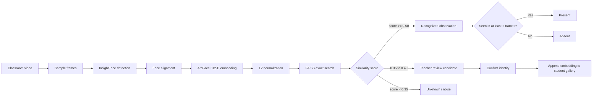

# FaceAttend

### Robust Classroom Attendance Using Multi-Embedding Face Recognition

[](https://www.python.org/)
[](https://fastapi.tiangolo.com/)
[](https://github.com/deepinsight/insightface)
[](https://github.com/facebookresearch/faiss)

FaceAttend is a locally hosted classroom-attendance application that recognizes enrolled students from short classroom videos. It combines InsightFace detection and ArcFace embeddings, exact FAISS similarity search, multi-frame voting, multi-embedding enrollment, teacher-reviewed recognition improvement, attendance management, evaluation metrics and Excel reporting.

> Face images and embeddings are biometric data. Runtime data is ignored by Git and should never be committed to a public repository without informed consent and an appropriate retention policy.

## Screenshots

| Student enrollment | Video attendance |
|---|---|
|  |  |

## Example Video Inference

`hostel_room.mp4` was evaluated locally through the same production video pipeline with attendance persistence and Active Learning disabled.

| Property | Measured result |
|---|---:|
| Resolution | 1920 × 1080 |
| Video duration | 5.00 s |
| Source video | 30 FPS / 150 frames |
| Sampled for inference | 3 FPS / 15 frames |
| Face observations | 166 |
| Local enrolled gallery | 18 students |
| Predicted attendance | 11 present / 7 absent |
| Processing time | 34.78 s |
| Processing throughput | 0.43 sampled frames/s |
| Real-time factor | 0.14× |
| Runtime hardware | CUDA — NVIDIA GeForce RTX 3050 Laptop GPU, 4 GB |

This is an inference demonstration, not an accuracy measurement, because no ground-truth attendance labels were supplied. Face observations are detections accumulated across sampled frames, not 166 unique people. Timing excludes one-time model/FAISS initialization and browser upload, but includes frame extraction, detection, embedding generation, matching and multi-frame voting. The source video and biometric gallery are intentionally excluded from Git.

Run the same non-persistent benchmark on another local video:

```powershell
python -m scripts.benchmark_video path\to\classroom.mp4 --json
```

## Highlights

- Enroll each student from multiple face images and retain every valid 512-dimensional embedding.
- Process short classroom videos at a configurable sampling rate.
- Detect small and distant faces using full-frame and overlapping-tile detection on supported GPU setups.
- Match normalized embeddings with exact FAISS `IndexFlatIP` cosine-similarity search.
- Require recognition across multiple sampled frames before marking a student present.
- Review uncertain faces and append teacher-confirmed embeddings to the appropriate student gallery.
- Edit students, manage enrollment photos and override attendance status.
- Evaluate recognition-level attendance predictions using precision, recall and F1 score.
- Export date-range attendance reports as formatted Excel workbooks.
- Run locally with SQLite and filesystem-based biometric storage.

## Recognition Pipeline



### Similarity and decision rules

ArcFace embeddings are L2-normalized before matching:

```text
x_normalized = x / ||x||₂
cosine(x, y) = x_normalized · y_normalized
```

Because vectors are normalized, inner product equals cosine similarity. A value such as `0.76` is a similarity score, not a calibrated statement of “76% certainty.”

| Rule | Default decision |
|---|---|
| Similarity `>= 0.50` | Recognized frame-level observation |
| Similarity `0.35–0.49` | Eligible for teacher review |
| Similarity `< 0.35` | Unknown/noise |
| Recognized in at least `2` sampled frames | Present |
| Recognized in fewer than `2` sampled frames | Absent |

These defaults should be calibrated using representative videos from the intended classroom, cameras, lighting and student population.

## Technology

| Layer | Technology |
|---|---|
| Web API | FastAPI, Uvicorn |
| UI | HTML, CSS, vanilla JavaScript |
| Database | SQLite, SQLAlchemy, aiosqlite |
| Detection and embeddings | InsightFace Buffalo_L ONNX models |
| Inference runtime | ONNX Runtime CPU or CUDA |
| Similarity search | FAISS `IndexFlatIP` |
| Video processing | OpenCV |
| Reports | pandas, openpyxl |

The application loads only the detection and recognition components from Buffalo_L. InsightFace stores downloaded model files under the current user profile, normally `~/.insightface/models/buffalo_l/`; model binaries are not committed to this repository.

## Project Structure

```text
.
├── backend/
│   ├── main.py                     # FastAPI application and startup
│   ├── database.py                 # Async SQLAlchemy configuration
│   ├── models/                     # Database table definitions
│   ├── routers/                    # Students, attendance and evaluation APIs
│   └── services/
│       ├── face_detector.py        # Full-frame/tiled face detection and NMS
│       ├── recognizer.py           # Embeddings, gallery cache and FAISS search
│       ├── video_processor.py      # Sampling, voting and recognition pipeline
│       └── excel_export.py         # Attendance workbook generation
├── frontend/
│   ├── templates/index.html        # Single-page teacher interface
│   └── static/                     # CSS, JavaScript and favicon
├── scripts/benchmark_video.py       # Non-persistent inference benchmark
├── data/                            # Local runtime data; contents are ignored
├── docs/screenshots/                # Public README images
├── .env.example                     # Supported configuration
└── requirements.txt                 # Python dependencies
```

## Installation

### Prerequisites

- Python 3.10 or newer
- Git
- At least 4 GB of free disk space for the environment and model files
- A modern web browser
- Optional: NVIDIA CUDA-compatible GPU and matching ONNX Runtime GPU dependencies

### Windows PowerShell

```powershell
git clone https://github.com/sangampaudel530/Robust-Classroom-Attendance-System-Using-Deep-Face-Recognition-with-Multi-Embedding-Matching.git
cd Robust-Classroom-Attendance-System-Using-Deep-Face-Recognition-with-Multi-Embedding-Matching

py -m venv .venv
.\.venv\Scripts\Activate.ps1
python -m pip install --upgrade pip setuptools wheel
pip install -r requirements.txt
Copy-Item .env.example .env

uvicorn backend.main:app --host 127.0.0.1 --port 8000
```

### Linux or macOS

```bash
git clone https://github.com/sangampaudel530/Robust-Classroom-Attendance-System-Using-Deep-Face-Recognition-with-Multi-Embedding-Matching.git
cd Robust-Classroom-Attendance-System-Using-Deep-Face-Recognition-with-Multi-Embedding-Matching

python3 -m venv .venv
source .venv/bin/activate
python -m pip install --upgrade pip setuptools wheel
pip install -r requirements.txt
cp .env.example .env

uvicorn backend.main:app --host 127.0.0.1 --port 8000
```

Open [http://127.0.0.1:8000](http://127.0.0.1:8000). Interactive API documentation is available at [http://127.0.0.1:8000/docs](http://127.0.0.1:8000/docs).

On the first run, InsightFace may download the Buffalo_L model pack. Startup waits until the recognition engine and FAISS gallery are ready, so the first launch can take longer than later launches.

### Optional GPU inference

The default requirements install CPU ONNX Runtime. For a compatible NVIDIA CUDA environment, replace it with the GPU package:

```powershell
pip uninstall -y onnxruntime
pip install onnxruntime-gpu
```

Confirm the provider after startup by checking the server log for `CUDAExecutionProvider`. Follow the ONNX Runtime compatibility documentation for the required CUDA and cuDNN versions.

## Configuration

Copy `.env.example` to `.env` and adjust only what your deployment requires.

| Variable | Default | Purpose |
|---|---:|---|
| `DATABASE_URL` | `sqlite+aiosqlite:///./face_attendance.db` | SQLAlchemy database connection |
| `EMBED_DIR` | `data/embeddings` | Confirmed per-student `.npz` galleries |
| `PHOTO_DIR` | `data/student_photos` | Enrollment photos |
| `UPLOAD_DIR` | `data/uploads` | Temporary videos and representative frames |
| `ACTIVE_LEARNING_DIR` | `data/active_learning` | Teacher-review face crops |
| `ACTIVE_LEARNING_EMBED_DIR` | `data/active_learning_embeddings` | Temporary candidate vectors |
| `FACE_MATCH_THRESHOLD` | `0.50` | Frame-level recognition threshold |
| `VIDEO_TARGET_FPS` | `3` | Sampled frames per video second |
| `VIDEO_MIN_FRAMES` | `2` | Required recognized observations for Present |
| `VIDEO_MAX_FRAMES` | `60` | Maximum sampled frames per video |
| `VIDEO_MAX_FRAME_DIMENSION` | `1920` | Maximum decoded frame dimension |
| `VIDEO_PREVIEW_EVERY` | `3` | Sample interval for browser previews only |
| `MAX_VIDEO_UPLOAD_MB` | `250` | Upload-size limit |

`VIDEO_PREVIEW_EVERY` affects only browser preview transmission. Recognition still processes every sampled frame.

## Usage

1. Open **Enroll Student** and provide a unique roll number, name and several clear face photos.
2. Include frontal and modest left/right angles, normal classroom lighting and commonly worn glasses where applicable.
3. Open **Video Attendance**, select the date and upload a short classroom video.
4. Review the resulting Present/Absent records and use the override control when human correction is required.
5. Open **Active Learning** to review uncertain candidates. Confirming one appends its embedding to the assigned student’s gallery; it does not retrain the neural network.
6. Use **Evaluation Metrics** with known ground-truth roll numbers to measure precision, recall and F1 on representative videos.
7. Export attendance reports from **Export Excel**.

## Storage Model

| Data | Default location | Format |
|---|---|---|
| Students, attendance and evaluation records | `face_attendance.db` | SQLite |
| Confirmed student embeddings | `data/embeddings/<roll_no>.npz` | `N × 512` float32 array |
| Enrollment photos | `data/student_photos/<roll_no>/` | Images |
| Temporary review embeddings | `data/active_learning_embeddings/<candidate_id>.npy` | 512-D float32 vector |
| Review crops | `data/active_learning/` | Images |
| Runtime search index | Process memory | FAISS `IndexFlatIP` |

Each student keeps multiple embeddings rather than one averaged template. FAISS indexes every embedding with the corresponding roll number, allowing a query to match the student’s most similar stored pose or lighting condition.

## Main API Endpoints

| Method | Endpoint | Purpose |
|---|---|---|
| `GET` | `/health` | Service health check |
| `GET` | `/api/students` | List active students |
| `POST` | `/api/students/enroll` | Enroll a student from photos |
| `PUT` | `/api/students/{roll_no}` | Update student details |
| `POST` | `/api/attendance/process-video` | Stream video-processing progress and results |
| `GET` | `/api/attendance/{date}` | Read attendance for a date |
| `PUT` | `/api/attendance/{date}/{roll_no}` | Override an attendance status |
| `POST` | `/api/attendance/evaluate` | Evaluate against supplied ground truth |
| `GET` | `/api/attendance/export/excel` | Export an Excel report |

See `/docs` after startup for the complete OpenAPI reference.

## Evaluation Notes

The evaluation page measures the final attendance-recognition decision, not generic face-detection accuracy. It compares predicted-present roll numbers with teacher-provided ground truth:

- **Precision:** how many predicted-present students were correct.
- **Recall:** how many truly present students were found.
- **F1:** harmonic mean of precision and recall.

Report processing time together with hardware, runtime provider, resolution, duration, source FPS, sampled frames and detected faces. Timing is hardware- and scene-dependent and should not be presented without that context.

## Privacy and Production Hardening

- Obtain informed consent before collecting face images or embeddings.
- Define retention, deletion, access-control and incident-response policies.
- Do not publish `data/`, `.env`, database files, classroom videos or model caches.
- Encrypt sensitive data at rest and in transit in real deployments.
- Add authentication and role-based authorization before exposing the application on a network.
- Restrict the current permissive CORS policy to trusted origins.
- Treat automated attendance as decision support and retain teacher review/override.
- Test demographic, lighting, pose and camera-condition performance on the intended population.
- Review InsightFace’s code and pretrained-model licensing before commercial use.

## Troubleshooting

### First startup is slow

The model pack may be downloading or ONNX sessions may be initializing. Wait for `Face-recognition engine ready` in the server log.

### CUDA is not being used

Check `onnxruntime.get_available_providers()` and verify CUDA/cuDNN compatibility. Installing `onnxruntime-gpu` alone does not install the NVIDIA runtime libraries.

### A known student is repeatedly uncertain

Add several clear enrollment images or confirm correctly assigned review candidates. Verify lighting, face size, blur and occlusion before lowering the similarity threshold.

### FAISS import fails

Use a Python version and platform for which `faiss-cpu` provides a wheel, or install FAISS using the platform’s recommended package manager.

## Contributors

- Sangam Paudel
- Roshan Koirala
- Sahas Khadka

## License

The project source code is released under the [MIT License](LICENSE). Third-party libraries and pretrained InsightFace models remain subject to their respective licenses and usage conditions.

## Acknowledgements

- [InsightFace](https://github.com/deepinsight/insightface) for face-analysis models and tooling
- [FAISS](https://github.com/facebookresearch/faiss) for vector similarity search
- [FastAPI](https://fastapi.tiangolo.com/) and [OpenCV](https://opencv.org/) for the application and video-processing foundations
